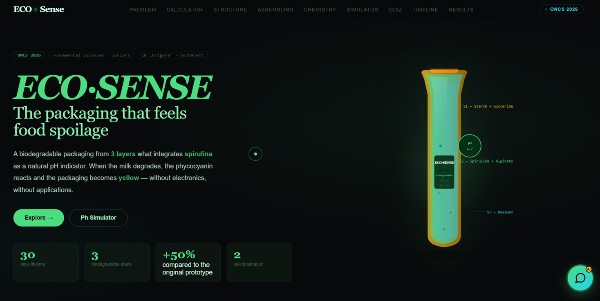
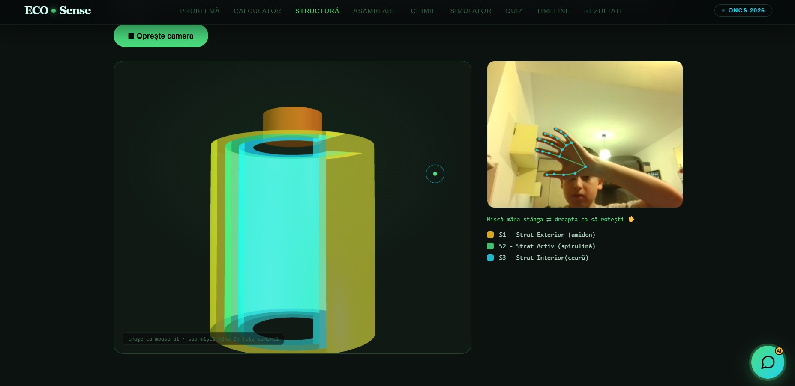
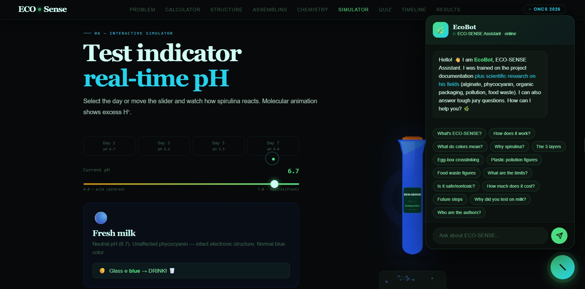

# ECO SENSE
## Demo: https://mateii96.github.io/ECO-SENSE/

This website is about a natural bottle where you put milk and when the milk expires the bottle changes color from blue to yellow because of the pH changes.

This website wants to promote the bottle with an interactive website with information from layers to advanced chemistry.

I also participated at a national olympiad with this product even working in reality and the jury was very interested in my idea.

I also have the EcoBot:a chatbot trained with project's data refered to this bottle.so when you have a curiosity, check the EcoBot.

I made a 3d model with every layer that you can rotate by activating the camera and it tracks the hand, so by this it rotates the 3d model.

## Every layer:
-external layer.
-active layer(medium layer).
-intern layer.

## Tutorial:
For best experience I suggest you to translate the website from Romanian to English.
Best optimized for desktop.
To rotate the 3d model use the mouse or activate the camera and move your hand and you will see how the 3d model moves because I used mediapipe.
The EcoBot is best optimized for Romanian.I suggest you to use the presets of the EcoBot because if you manually type a prompt it is very likely for the EcoBot to not understand the prompt. If you want to see how the ai works mannualy tiping check the "kw:[...]" part in index.html lines 1515-1545.

## Technical information:
The website is made in CSS,HTML and JavaScript.
Mediapipe for 3d model.

## Screenshots:

## AI use:
AI used for debugging.

#horizons